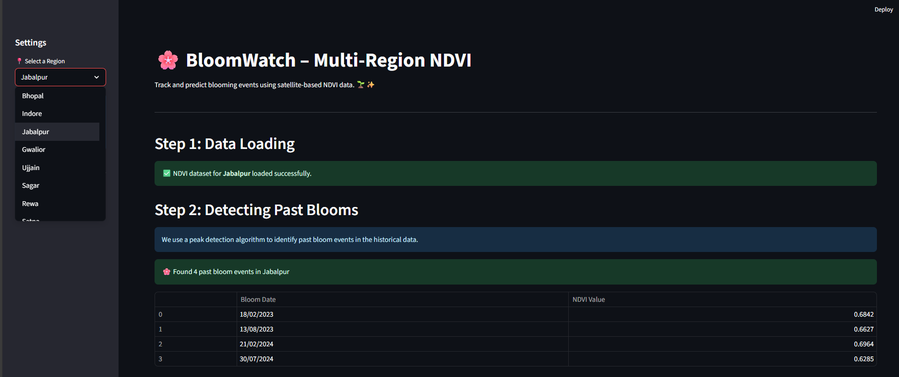
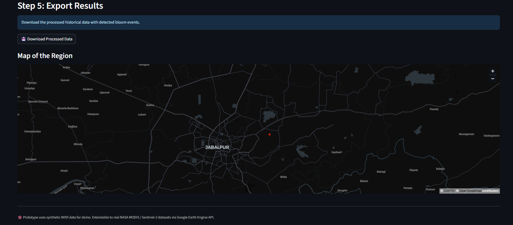

# 🌸 BloomWatch – Prototype

## 📌 Overview
BloomWatch is a **satellite-data powered prototype** that detects and predicts blooming events in vegetation using the **Normalized Difference Vegetation Index (NDVI)**.  
The system leverages **historical NDVI data** to detect past bloom events 🌱 and uses **time-series forecasting** to predict upcoming bloom cycles 🔮.  

This prototype is designed for the NASA Space Apps Challenge 2025 and currently demonstrates the solution with **synthetic NDVI datasets for 8 regions in Madhya Pradesh, India**.  
🚀 **In future development, the system can be extended to all regions across India, and globally, by directly integrating with NASA MODIS and Sentinel-2 satellite datasets via Google Earth Engine (GEE).**

---

## 🚀 Features
- 📍 **Multi-region support** – Select from 8 demo regions (Bhopal, Indore, Jabalpur, Gwalior, Ujjain, Sagar, Rewa, Satna). Further it can be extended to all regions across India, and globally.
- 🌸 **Bloom detection** – Identifies past bloom events using NDVI peak detection.  
- 🔮 **Bloom prediction** – Forecasts future bloom events using **Facebook Prophet**.  
- 📊 **Interactive visualization** – Timeline plots with raw NDVI, smoothed NDVI, detected blooms, and future predictions.  
- 🗺️ **Regional mapping** – Simple map to locate regions.  
- 💾 **Data export** – Download processed bloom data as CSV.  

---

## 🛠️ Tech Stack

- **Frontend/UI:** 
  - **Prototype:** Streamlit + Plotly  
  - **Main project (future):** React.js + Leaflet for interactive dashboard  

- **Backend/Processing:** FastAPI (APIs for preprocessing & ML serving), Python, Pandas, SciPy, Prophet, scikit-learn  

- **Machine Learning:** `find_peaks` (detection), Prophet / scikit-learn (forecasting)  

- **Database:** PostgreSQL + PostGIS (geospatial & time-series storage)  

- **Visualization:** Plotly / Matplotlib for graphs, Leaflet maps for geospatial data  

- **Hosting:** Streamlit Cloud (prototype), AWS / Azure (scalable main deployment)  
 

---

## 🌍 Data Sources
- Prototype currently uses **synthetic NDVI datasets (2023–2024)** for demo.  
- The system is fully **extendable to real satellite datasets**:  
  - 🛰️ **NASA MODIS Terra/Aqua NDVI** (MOD13Q1, MOD09GA)  
  - 🛰️ **ESA Sentinel-2 Surface Reflectance**  
- Integration via **Google Earth Engine (GEE) API** will allow automatic NDVI time-series extraction for any location globally.  

---

## 📸 Prototype Snapshots

These are some snapshots of the working BloomWatch prototype:

  
  
  

> The prototype demonstrates NDVI data loading, past bloom detection, future bloom prediction, interactive plots, and regional maps.

---

*🌸 Prototype uses synthetic NDVI data for demo. Extendable to real NASA MODIS / Sentinel-2 datasets via Google Earth Engine API.*
